# CRONOVA-INTERNSHIP-WEEK1
# Attack Surface Mapping: OWASP Juice Shop

*Week 1 · Reconnaissance and attack-surface discovery report*

# 1. Executive Summary

This report documents the reconnaissance and attack-surface mapping of **OWASP Juice Shop**, an intentionally vulnerable web application, deployed locally on a Kali Linux virtual machine. The goal was to answer one question: *what can an attacker discover about this application before attempting to exploit it?*

Using directory brute-forcing, HTTP probing, backend source-code route inspection and client-side resource analysis, the following was established:

- **Architecture:** an Angular single-page frontend talking to a Node.js / Express.js (TypeScript) backend on TCP 3000, persisting data in SQLite through the Sequelize ORM.
- **Web surface:** about 40 client-side routes, including authentication, user, administrative and Web3 pages, plus publicly reachable resources such as `/ftp` (directory listing), `/robots.txt`, `/promotion` and `/video`.
- **API surface:** two namespaces, `/api` and `/rest`, covering users, products, baskets, orders, payments, addresses, 2FA, CAPTCHA, wallet, chat, Web3 and administration, using GET, POST, PUT, PATCH and DELETE.
- **Access control:** JWT-based authentication, 2FA/TOTP, and middleware-based authorization (`isAuthorized`, `isAccounting`, `appendUserId`, `denyAll`).
- **Information leakage:** Swagger documentation, `/ftp` file names, and client-side code expose routes, endpoints and configuration references that are not visible through normal navigation.

The findings were consolidated into an inventory of **50 assets and endpoints**: **38 High**, **9 Medium** and **3 Low** priority. Section 10 explains which areas a follow-up penetration test should examine first and why.

> No vulnerability was exploited. HTTP 200 responses and the presence of an endpoint are recorded as *observations about exposure*, not as confirmed vulnerabilities.

# 2. Scope, Objectives and Methodology

## 2.1 Objectives

- Deploy a personal instance of OWASP Juice Shop and document the environment.
- Perform reconnaissance across four areas: web application discovery, API discovery, technology fingerprinting and client-side analysis.
- Convert the findings into an attack-surface map and a structured inventory.
- Prioritize the attack surface for a future penetration test.

## 2.2 Scope and Rules

Only the locally deployed instance at `http://localhost:3000` was assessed. The task was limited to reconnaissance and discovery; no exploitation, authentication bypass, credential validation or decryption of discovered files was attempted.

## 2.3 Methodology and Tools

| Phase                      | Technique                                                      | Tool / Source                                 |
|----------------------------|----------------------------------------------------------------|-----------------------------------------------|
| Environment verification   | System and HTTP checks                                         | `uname`, `node`, `npm`, `git`, `curl -I`      |
| Web discovery              | Directory and resource brute-forcing                           | Gobuster with `dirb/common.txt`               |
| Route discovery            | Inspection of frontend route definitions and HTTP verification | Source code, `curl`                           |
| API discovery              | Backend route inspection and frontend service analysis         | Source code (server routes, Angular services) |
| Technology fingerprinting  | Package manifests, source and response headers                 | `package.json`, response headers              |
| Client-side analysis       | Review of Angular source, services and token handling          | Source code, browser                          |
| Mapping and prioritization | Diagramming and risk-based ranking                             | Graphviz, inventory table                     |

# 3. Environment Setup

## 3.1 Overview

OWASP Juice Shop was deployed from source on a Kali Linux virtual machine (Option A of the task). The application was configured and started locally on TCP port 3000 so that reconnaissance could be performed against a controlled, intentionally vulnerable target.

## 3.2 Testing Environment

| Component           | Details                      |
|---------------------|------------------------------|
| Operating System    | Kali Linux                   |
| Architecture        | x86_64                       |
| Linux Kernel        | 6.19.14+kali-amd64           |
| Node.js             | v24.19.0                     |
| npm                 | 12.0.2                       |
| Git                 | 2.53                         |
| Application         | OWASP Juice Shop             |
| Juice Shop Version  | 20.2.0                       |
| Deployment Method   | Local source-code deployment |
| Application Address | http://localhost:3000        |
| Application Port    | TCP 3000                     |

The environment was verified with `uname -a`, `node --version`, `npm --version` and `git --version`.

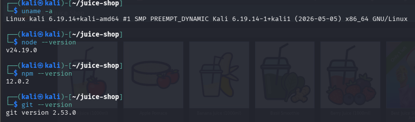

*Figure 1. System information of the Kali Linux testing environment*

## 3.3 Juice Shop Installation

The official repository was cloned with a shallow clone, then the project directory was opened and listed to verify its structure:

- `git clone https://github.com/juice-shop/juice-shop.git --depth 1`
- `cd juice-shop`
- `ls`

The repository contains the frontend, backend, routes, models, configuration files, Docker configuration and other project resources.

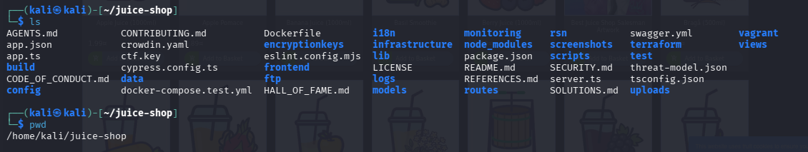

*Figure 2. Cloned Juice Shop repository and project structure*

## 3.4 Dependency Installation

Dependencies were installed with `npm install`, which also built the frontend, and the server was then compiled with `npm run build:server`. Both completed successfully. npm reported deprecated dependencies and audit findings; these were intentionally left unchanged because the purpose of the exercise is to assess Juice Shop in its supplied state.

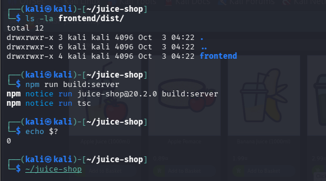

*Figure 3. Dependency installation and server build*

## 3.5 Starting the Application

The application was started with `npm start` and opened in a browser at `http://localhost:3000`. The Juice Shop storefront loaded successfully, confirming that the application was operational.

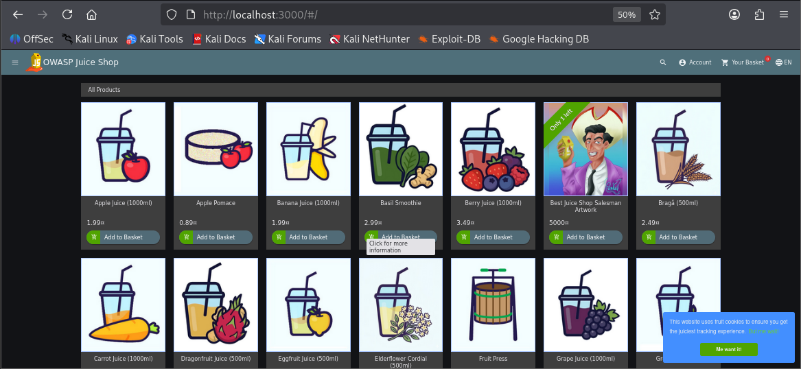

*Figure 4. Juice Shop homepage running at http://localhost:3000*

## 3.6 HTTP Connectivity Verification

Availability was also confirmed from the command line with `curl -I http://localhost:3000`.

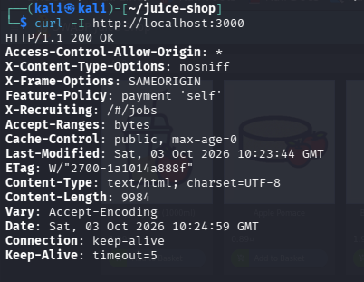

*Figure 5. HTTP response headers returned by curl -I*

# 4. Web Application Discovery

This phase identified publicly exposed pages, application routes, authentication-related functionality, user functionality, administrative functionality, interesting resources and hidden paths. It was limited to reconnaissance; no exploitation or bypass was performed.

## 4.1 Publicly Accessible Pages

A direct request to the homepage returned HTTP 200, confirming access without authentication. Resource discovery was then run with Gobuster:

- `gobuster dir -u http://localhost:3000 -w /usr/share/wordlists/dirb/common.txt -t 20 --exclude-length 9984`

| Resource    | Status | Observation                              |
|-------------|--------|------------------------------------------|
| /           | 200    | Main application homepage                |
| /ftp        | 200    | Publicly accessible resource / directory |
| /promotion  | 200    | Public promotion resource                |
| /robots.txt | 200    | Public robots file                       |
| /video      | 200    | Public video resource                    |
| /assets/    | 301    | Redirected resource path                 |
| /media/     | 301    | Redirected resource path                 |

The `/ftp` resource was particularly notable because it returned a directory listing containing multiple files and a subdirectory.

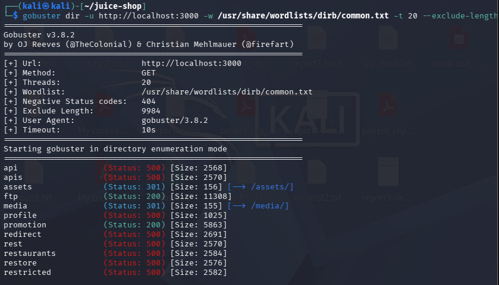

*Figure 6. Homepage HTTP response and Gobuster discovery output*

## 4.2 Application Routes

Routes were identified by examining the frontend and build files for route definitions. Dynamic parameters such as `:addressId`, `:id`, `:user` and `:challengeKey` mark routes that accept variable values.

- `/`
- `/admin`
- `/administration`
- `/accounting`
- `/address/create`
- `/address/edit/:addressId`
- `/address/saved`
- `/address/select`
- `/bank-transfer`
- `/basket`
- `/change-password`
- `/chatbot`
- `/chat/:user`
- `/coding-challenge/:challengeKey`
- `/complain`
- `/contact`
- `/conversation/:id`
- `/dashboard`
- `/data-export`
- `/delivery-method`
- `/deluxe-membership`
- `/detail/:id`
- `/forgot-password`
- `/hacking-instructor`
- `/juicy-nft`
- `/last-login-ip`
- `/login`
- `/order-completion`
- `/order-completion/:id`
- `/order-history`
- `/order-summary`
- `/payment/:entity`
- `/payment/shop`
- `/photo-wall`
- `/privacy-policy`
- `/privacy-security`
- `/recipes/:id`
- `/recycle`
- `/register`
- `/saved-payment-methods`
- `/score-board`
- `/search`
- `/user/:name`

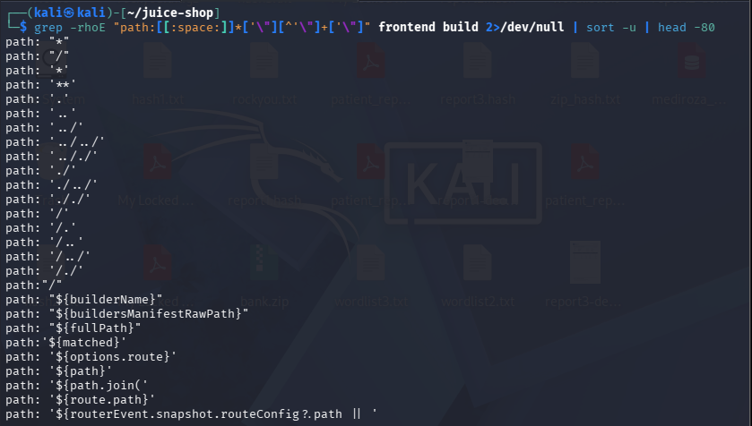

*Figure 7. Route extraction from the frontend source (1 of 2)*

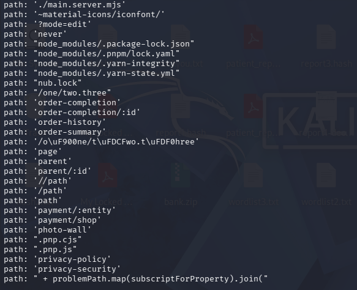

*Figure 8. Route extraction from the frontend source (2 of 2)*

## 4.3 Authentication-Related Pages

Authentication routes were taken from the route definitions and verified against the running application; all returned HTTP 200.

| Authentication-related page | HTTP Status |
|-----------------------------|-------------|
| /login                      | 200         |
| /register                   | 200         |
| /forgot-password            | 200         |
| /change-password            | 200         |
| /2fa/enter                  | 200         |

This covers account registration, login, password recovery, password change and two-factor authentication entry. The `/last-login-ip` route was also found in the source and recorded for further investigation.

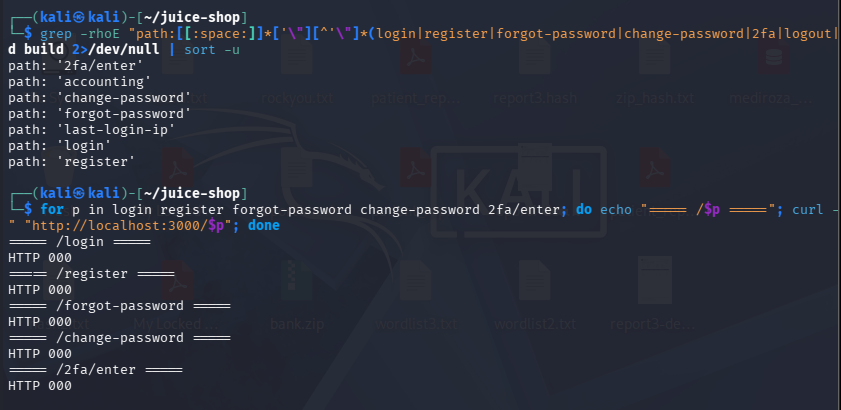

*Figure 9. Route extraction output and HTTP verification of authentication routes (1 of 2)*

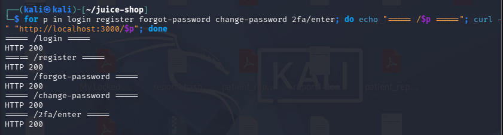

*Figure 10. Route extraction output and HTTP verification of authentication routes (2 of 2)*

## 4.4 User Functionality

User-oriented routes identified: `/address/create`, `/address/edit/:addressId`, `/address/saved`, `/address/select`, `/basket`, `/chatbot`, `/chat/:user`, `/complain`, `/contact`, `/conversation/:id`, `/delivery-method`, `/order-completion`, `/order-history`, `/order-summary`, `/payment/:entity`, `/payment/shop`, `/saved-payment-methods` and `/user/:name`. The following were verified against the running application:

| Route                  | HTTP Status |
|------------------------|-------------|
| /basket                | 200         |
| /address/saved         | 200         |
| /address/select        | 200         |
| /order-history         | 200         |
| /order-summary         | 200         |
| /payment/shop          | 200         |
| /saved-payment-methods | 200         |
| /contact               | 200         |
| /complain              | 200         |
| /chatbot               | 200         |

These routes relate to shopping baskets, addresses, orders, payments, saved payment methods, communication and chatbot/conversation features.

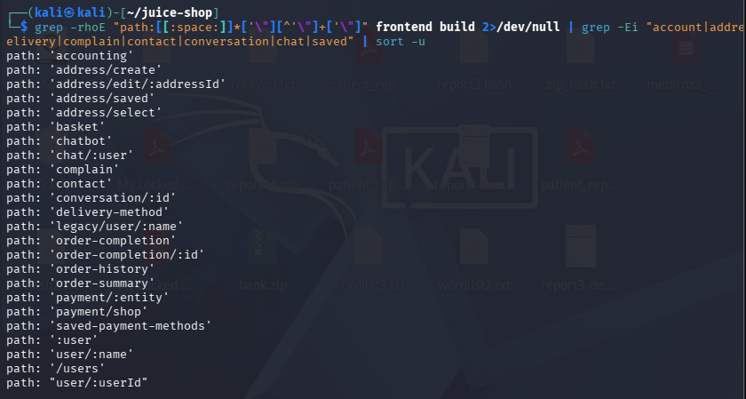

*Figure 11. HTTP verification of user functionality routes (1 of 2)*

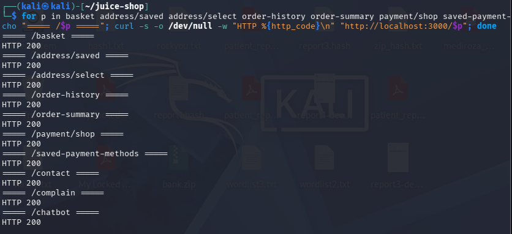

*Figure 12. HTTP verification of user functionality routes (2 of 2)*

## 4.5 Administrative Functionality

Administrative and management-related routes identified, all returning HTTP 200:

| Route              | HTTP Status |
|--------------------|-------------|
| /admin             | 200         |
| /Admin             | 200         |
| /administration    | 200         |
| /dashboard         | 200         |
| /accounting        | 200         |
| /deluxe-membership | 200         |
| /score-board       | 200         |

> HTTP 200 only confirms that a path is reachable at the application level. It does **not** establish that administrative privileges were obtained or that protected administrative actions were accessible. No authentication bypass or administrative exploitation was performed.

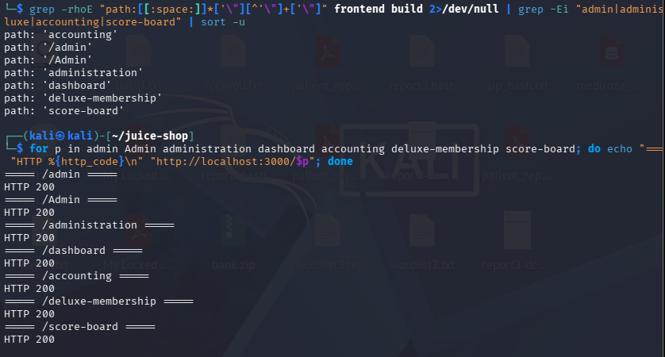

*Figure 13. HTTP verification of administrative routes*

## 4.6 Interesting Resources

| Resource     | HTTP Status        | Size            | Relevance                                      |
|--------------|--------------------|-----------------|------------------------------------------------|
| /ftp         | 200                | 11,308 bytes    | Public resource containing a directory listing |
| /robots.txt  | 200                | 28 bytes        | May disclose crawler-related paths             |
| /assets/     | 200 after redirect | —               | Frontend / static resources                    |
| /media/      | 200 after redirect | —               | Media-related resource                         |
| /video       | 200                | 2,232,676 bytes | Public video resource                          |
| /promotion   | 200                | 5,863 bytes     | Public promotion resource                      |
| /swagger.yml | 200                | 9,984 bytes     | API documentation-related resource             |

The `/ftp` listing exposed the following file names. They were recorded as **discovered resources only**; no attempt was made to exploit or decrypt them.

- `ftp/acquisitions.md`
- `ftp/announcement_encrypted.md`
- `ftp/coupons_2013.md.bak`
- `ftp/eastere.gg`
- `ftp/encrypt.pyc`
- `ftp/incident-support.kdbx`
- `ftp/legal.md`
- `ftp/package-lock.json.bak`
- `ftp/package.json.bak`
- `ftp/suspicious_errors.yml`

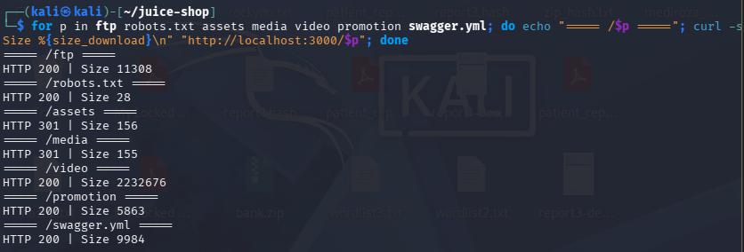

*Figure 14. Contents of the /ftp directory listing*

## 4.7 Hidden or Non-Obvious Application Paths

Gobuster identified additional paths that were not part of the normal route list. All returned HTTP 500, recorded as observed application behaviour and not classified as vulnerabilities:

| Path         | Response |
|--------------|----------|
| /api         | HTTP 500 |
| /apis        | HTTP 500 |
| /profile     | HTTP 500 |
| /redirect    | HTTP 500 |
| /rest        | HTTP 500 |
| /restaurants | HTTP 500 |
| /restore     | HTTP 500 |
| /restored    | HTTP 500 |
| /restricted  | HTTP 500 |

Other non-obvious resources: `/assets/`, `/media/`, `/ftp`, `/promotion`, `/robots.txt`. These paths are relevant to later API and application analysis.

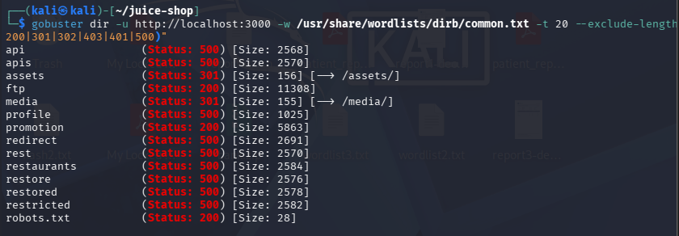

*Figure 15. Gobuster results showing non-obvious paths*

## 4.8 Summary

The web discovery phase revealed a broad surface: public resources, frontend routes, authentication functionality, shopping and user functionality, administrative-related routes, static and media resources, API-related paths and additional non-obvious endpoints. This forms the basis for API discovery.

# 5. API Discovery

API discovery combined backend source-code inspection with client-side resource analysis, so the result is not limited to endpoints visible through normal navigation. No vulnerability was exploited.

## 5.1 API Endpoints

The application exposes APIs under both `/api/` and `/rest/`. Examples identified:

- `/api/Users`
- `/api/Products`
- `/api/BasketItems`
- `/api/Cards`
- `/api/Addresss`
- `/api/Deliverys`
- `/api/Complaints`
- `/api/Feedbacks`
- `/api/PrivacyRequests`
- `/rest/user/login`
- `/rest/user/whoami`
- `/rest/products/search`
- `/rest/basket/:id`
- `/rest/order-history`
- `/rest/chat`
- `/rest/wallet/balance`
- `/rest/deluxe-membership`

Backend inspection revealed additional routes not necessarily visible through navigation, and frontend services reference Web3, 2FA, chat, CAPTCHA, wallet, payment, address and challenge-related APIs.

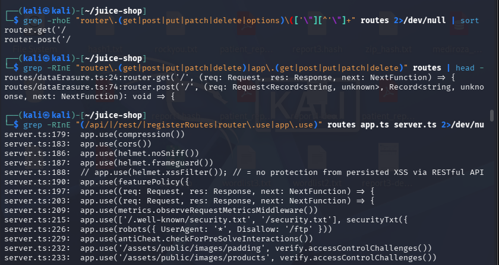

*Figure 16. Backend route and client-side API inspection (1 of 2)*

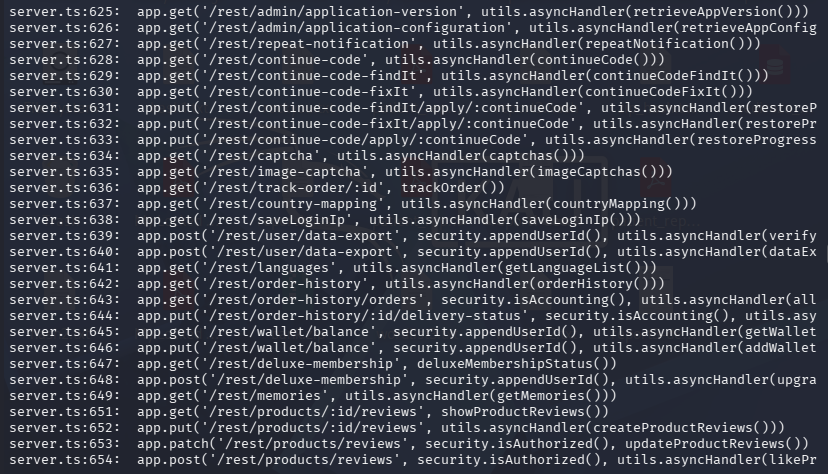

*Figure 17. Backend route and client-side API inspection (2 of 2)*

## 5.2 HTTP Methods

| Method | Example Endpoint                | Functionality             |
|--------|---------------------------------|---------------------------|
| GET    | /api/Users                      | User information          |
| POST   | /api/Products                   | Product-related operation |
| PUT    | /api/BasketItems/:id            | Basket item update        |
| DELETE | /api/Cards/:id                  | Payment method deletion   |
| POST   | /rest/user/login                | User authentication       |
| GET    | /rest/products/search           | Product search            |
| GET    | /rest/basket/:id                | Retrieve basket           |
| POST   | /rest/basket/:id/checkout       | Basket checkout           |
| PUT    | /rest/basket/:id/coupon/:coupon | Apply coupon              |
| PATCH  | /rest/products/reviews          | Product review operation  |

Backend route definitions confirmed the presence of GET, POST, PUT, PATCH and DELETE.

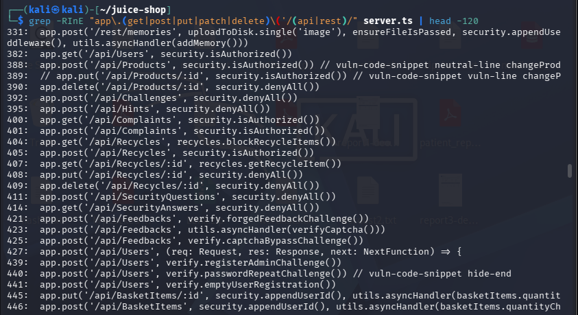

*Figure 18. Route definitions showing the HTTP methods in use (1 of 2)*

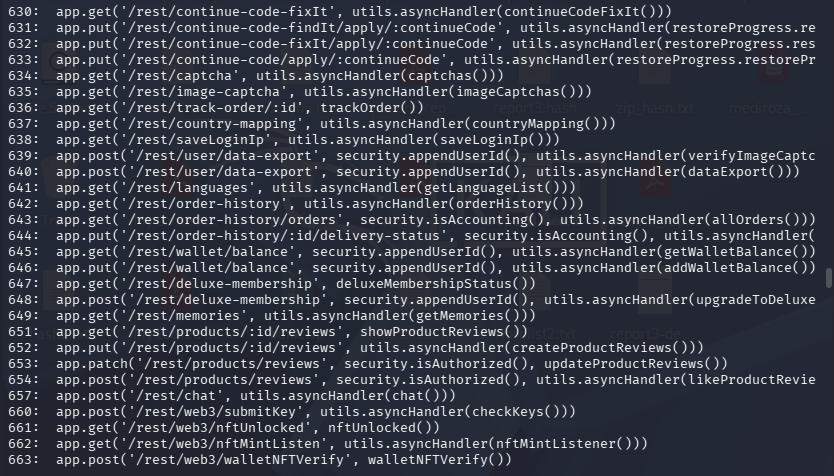

*Figure 19. Route definitions showing the HTTP methods in use (2 of 2)*

## 5.3 Authentication Requirements

The backend uses several security middleware functions to control API access:

| Middleware                | Purpose                                           |
|---------------------------|---------------------------------------------------|
| `security.isAuthorized()` | Endpoints requiring an authenticated user         |
| `security.isAccounting()` | Functionality requiring accounting-level access   |
| `security.appendUserId()` | Associates requests with the current user context |
| `security.denyAll()`      | Prevents access to the associated endpoint        |

Basket functionality is protected by authorization middleware, and some user, complaint and other resources also require authorization. Additional access-control mechanisms exist for cards, addresses, privacy requests, 2FA, wallet and order history. These document the mechanisms **present**; no bypass was attempted.

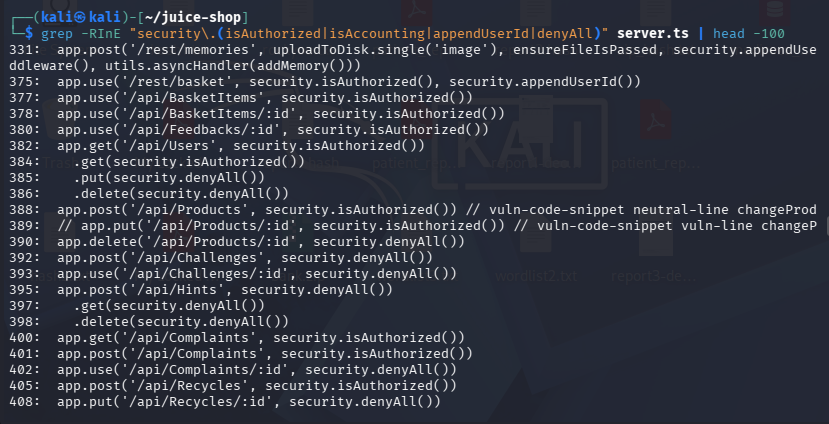

*Figure 20. Security middleware applied to backend routes (1 of 2)*

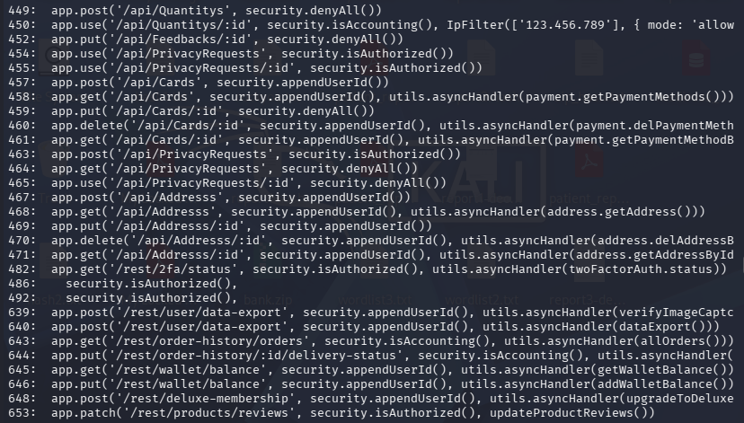

*Figure 21. Security middleware applied to backend routes (2 of 2)*

## 5.4 User-Related Endpoints

- `/api/Users`
- `/api/Users/:id`
- `/rest/user/login`
- `/rest/user/change-password`
- `/rest/user/reset-password`
- `/rest/user/security-question`
- `/rest/user/whoami`
- `/rest/user/authentication-details`
- `/rest/user/data-export`

The frontend `user.service.ts` references these endpoints, confirming they are actively used by client-side functionality. They are a key part of the user and authentication attack surface.

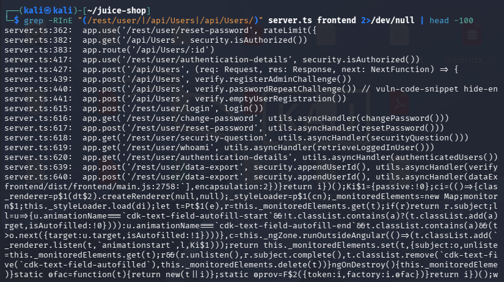

*Figure 22. User-related endpoints in the backend and frontend service (1 of 2)*

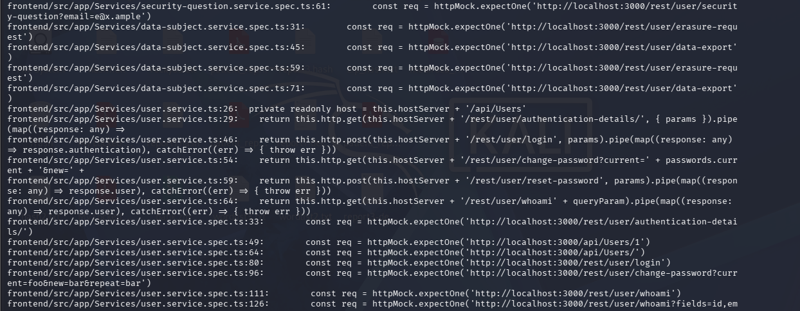

*Figure 23. User-related endpoints in the backend and frontend service (2 of 2)*

## 5.5 Product-Related Endpoints

- `/api/Products`
- `/rest/products/search`
- `/rest/products/:id/reviews`
- `/rest/products/reviews`

Frontend product services reference `/api/Products` and `/rest/products/search`. Product review functionality exposes GET, PUT, PATCH and POST operations.

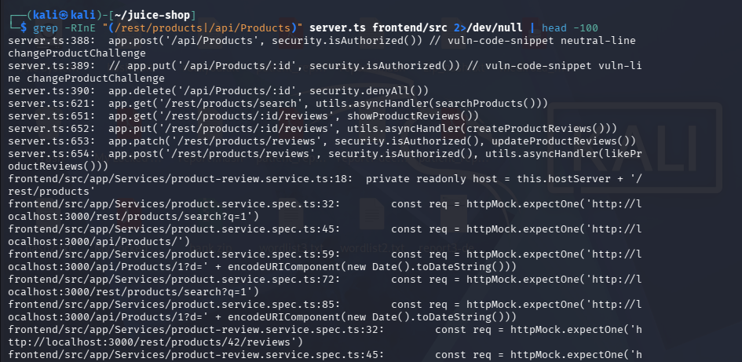

*Figure 24. Product-related endpoints (1 of 2)*

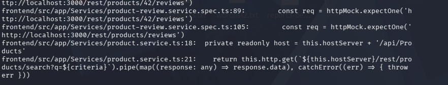

*Figure 25. Product-related endpoints (2 of 2)*

## 5.6 Basket and Order-Related Functionality

- `/api/BasketItems`
- `/api/BasketItems/:id`
- `/rest/basket/:id`
- `/rest/basket/:id/checkout`
- `/rest/basket/:id/coupon/:coupon`
- `/rest/order-history`
- `/rest/order-history/orders`
- `/rest/order-history/:id/delivery-status`

The basket API is protected by authorization middleware, while some order-history operations use accounting-level access control. Frontend basket and order-history services reference the same APIs.

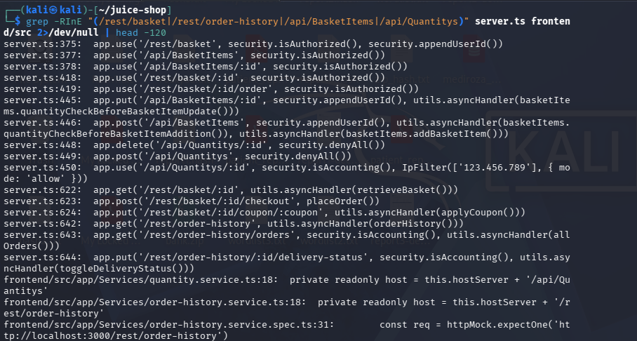

*Figure 26. Basket and order-related endpoints (1 of 2)*

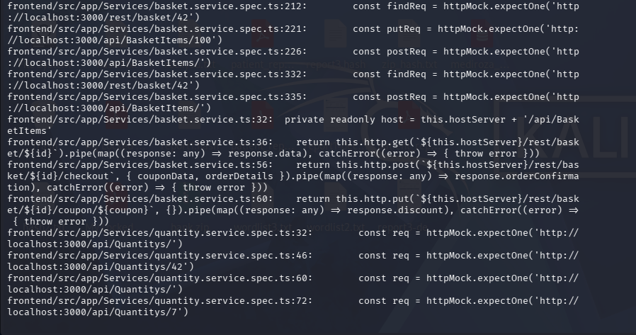

*Figure 27. Basket and order-related endpoints (2 of 2)*

## 5.7 Other Interesting API Functionality

| Functionality             | Example Endpoint        |
|---------------------------|-------------------------|
| Two-Factor Authentication | /rest/2fa/verify        |
| 2FA Status                | /rest/2fa/status        |
| CAPTCHA                   | /rest/captcha           |
| Image CAPTCHA             | /rest/image-captcha     |
| Order Tracking            | /rest/track-order/:id   |
| Wallet                    | /rest/wallet/balance    |
| Deluxe Membership         | /rest/deluxe-membership |
| Chat                      | /rest/chat              |
| Web3 / NFT                | /rest/web3/...          |
| Continue Code             | /rest/continue-code...  |
| Payment Cards             | /api/Cards              |
| Addresses                 | /api/Addresss           |
| Delivery                  | /api/Deliverys          |
| Complaints                | /api/Complaints         |
| Feedback                  | /api/Feedbacks          |
| Privacy Requests          | /api/PrivacyRequests    |
| Challenges                | /api/Challenges         |
| Hints                     | /api/Hints              |

Backend inspection confirmed these routes, while frontend services and tests show that many are referenced by client-side functionality, including Web3/NFT, 2FA, chat, CAPTCHA, wallet, payment cards, languages and continue-code endpoints.

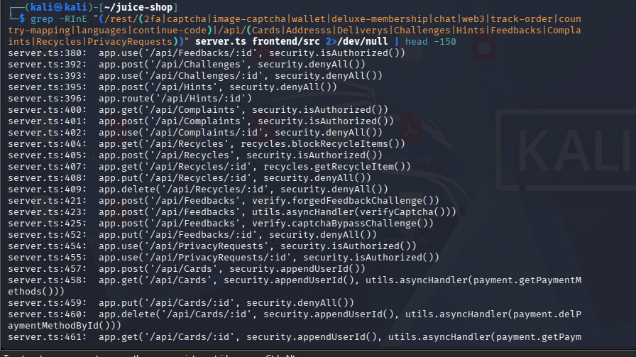

*Figure 28. Additional API functionality found through source inspection (1 of 2)*

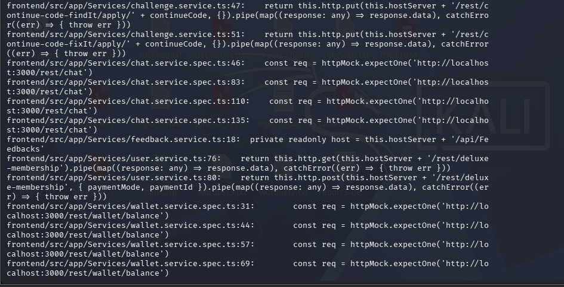

*Figure 29. Additional API functionality found through source inspection (2 of 2)*

## 5.8 Conclusion

The API surface spans user management, authentication, products, baskets, orders, payments, addresses, delivery, reviews, administration, 2FA, CAPTCHA, wallet, chat and Web3/NFT. It was discovered through backend route inspection and client-side resource analysis, and no exploitation or vulnerability verification was performed.

# 6. Technology Fingerprinting

| Layer                    | Identified Technology                                                                                   |
|--------------------------|---------------------------------------------------------------------------------------------------------|
| Frontend framework       | Angular 22.2.1 (Angular Router, Angular Material, Angular CDK)                                          |
| Backend                  | Node.js, Express.js 4.22.1, TypeScript                                                                  |
| Web / application server | Express.js on TCP 3000 (HTTP 200 OK)                                                                    |
| Database                 | SQLite (sqlite3 driver) via Sequelize ORM 6.37.3                                                        |
| JavaScript libraries     | Angular Animations / CDK / Material 22.0.1, RxJS 7.8.2, jwt-decode 4.0.0, Socket.IO Client 3.1.0        |
| API technologies         | REST via Express.js, namespaces /api and /rest, Swagger UI (swagger.yml, /api-docs)                     |
| Authentication           | JWT (jsonwebtoken), cookie / Authorization-header handling, 2FA/TOTP                                    |
| Other components         | CORS, Helmet, express-rate-limit, cookie-parser, CAPTCHA, Socket.IO, security.txt, robots.txt, Web3/NFT |

## 6.1 Frontend Framework

The application uses a modern Angular-based frontend with Angular routing and multiple components and modules. Angular Material and Angular CDK provide UI components. **Version recorded:** Angular 22.2.1.

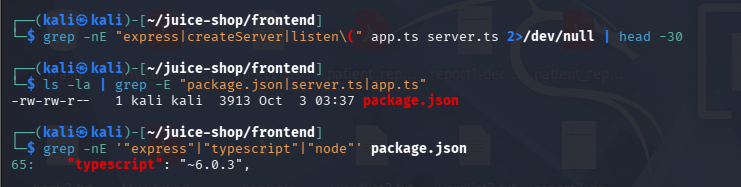

*Figure 30. Angular frontend evidence*

## 6.2 Backend

The backend is Node.js with Express.js 4.22.1 and TypeScript. Express handles HTTP requests, routes, middleware and API functionality.

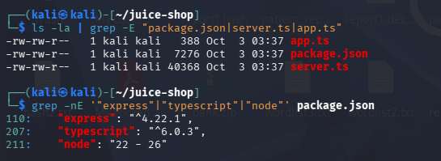

*Figure 31. Express.js backend evidence (1 of 2)*

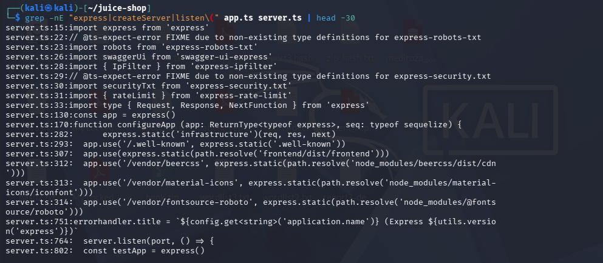

*Figure 32. Express.js backend evidence (2 of 2)*

## 6.3 Web Server

Express serves both the frontend and backend functionality. At runtime the application was reachable on port 3000 and returned HTTP 200 OK. Security-related response headers, including `X-Content-Type-Options` and `X-Frame-Options`, were observed.

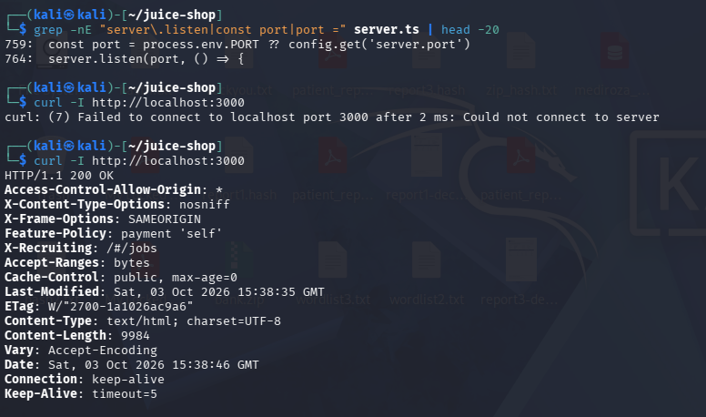

*Figure 33. Response headers from the running server*

## 6.4 Database

A relational database layer is provided by Sequelize ORM 6.37.3 on top of SQLite (sqlite3 driver). Application models use Sequelize for all database operations.

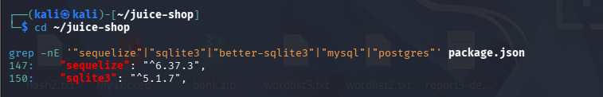

*Figure 34. Database and ORM evidence (1 of 3)*

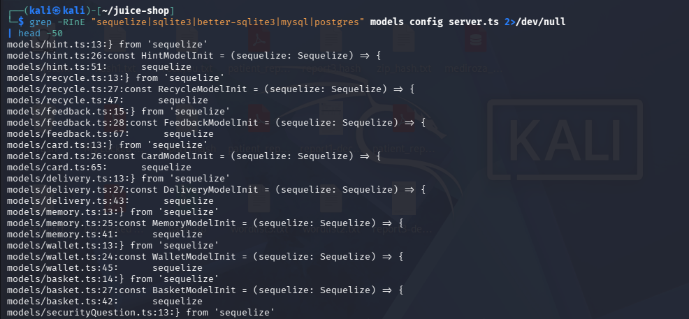

*Figure 35. Database and ORM evidence (2 of 3)*

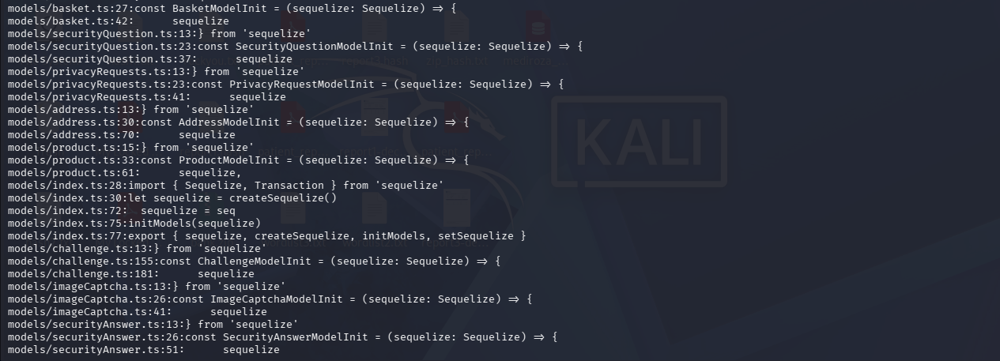

*Figure 36. Database and ORM evidence (3 of 3)*

## 6.5 JavaScript Libraries

| Library            | Version |
|--------------------|---------|
| Angular Animations | 22.0.1  |
| Angular CDK        | 22.0.1  |
| Angular Material   | 22.0.1  |
| RxJS               | 7.8.2   |
| jwt-decode         | 4.0.0   |
| Socket.IO Client   | 3.1.0   |

These indicate reactive frontend functionality, structured UI components, client-side JWT processing and real-time communication.

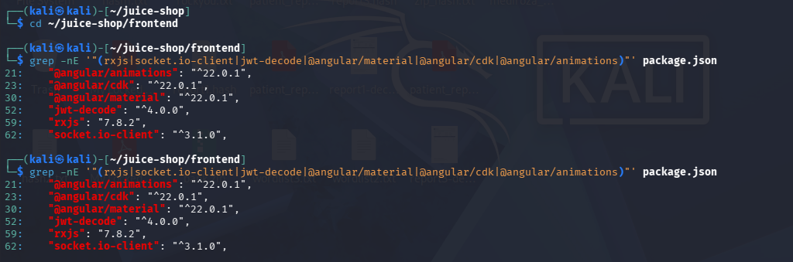

*Figure 37. Frontend library versions*

## 6.6 API Technologies

- **API framework / architecture:** Express.js, REST
- **Namespaces:** /api and /rest
- **Documentation:** Swagger UI, specification `swagger.yml`, endpoint `/api-docs`
- **Methods seen:** GET, POST, PUT and PATCH (DELETE also seen in backend routes, see Section 5.2)

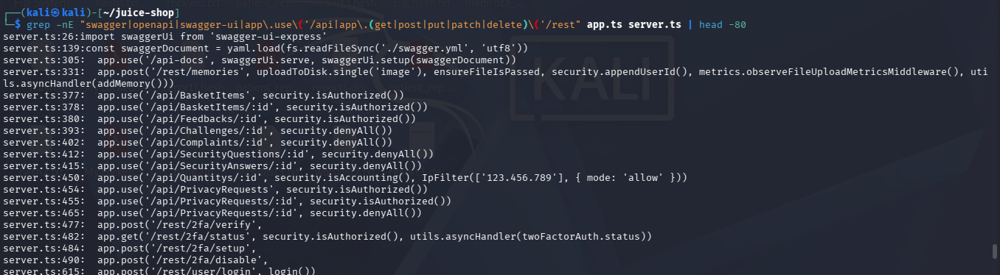

*Figure 38. API technology and Swagger documentation evidence (1 of 2)*

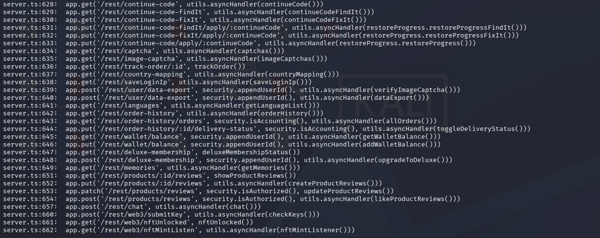

*Figure 39. API technology and Swagger documentation evidence (2 of 2)*

## 6.7 Authentication Mechanisms

- JWT-based functionality is present and tokens identify authenticated users.
- Tokens can be handled through cookies; Authorization headers are used by some functions.
- 2FA/TOTP is implemented; the `jsonwebtoken` library is used.

These are descriptions of the technologies identified and do not represent authentication vulnerabilities.

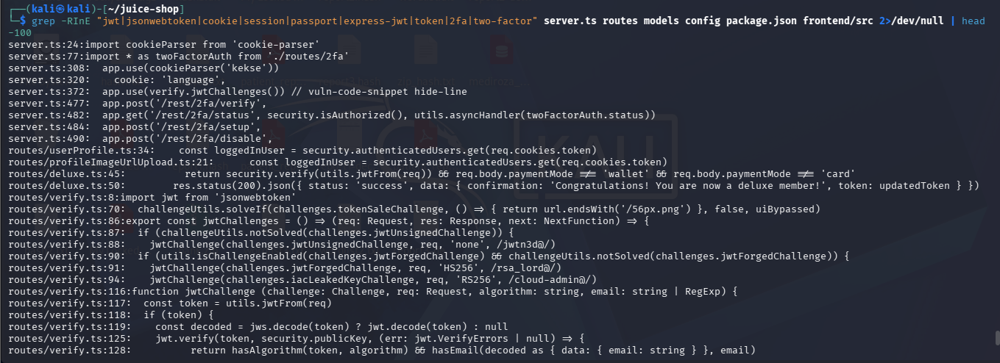

*Figure 40. Authentication mechanism evidence (1 of 2)*

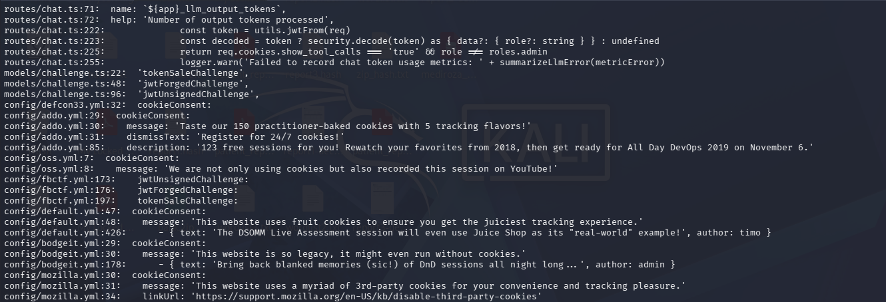

*Figure 41. Authentication mechanism evidence (2 of 2)*

## 6.8 Other Relevant Components

| Component                | Identified Technology   |
|--------------------------|-------------------------|
| Cross-Origin Requests    | CORS                    |
| Security Headers         | Helmet                  |
| Rate Limiting            | express-rate-limit      |
| Cookie Handling          | cookie-parser           |
| API Documentation        | Swagger UI              |
| CAPTCHA                  | CAPTCHA / Image CAPTCHA |
| Real-Time Communication  | Socket.IO               |
| Security Information     | security.txt            |
| Crawler Control          | robots.txt              |
| Blockchain Functionality | Web3/NFT components     |

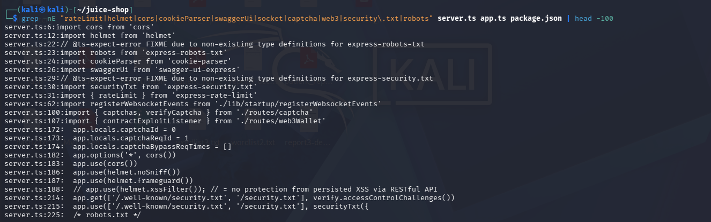

*Figure 42. Additional components identified (1 of 2)*

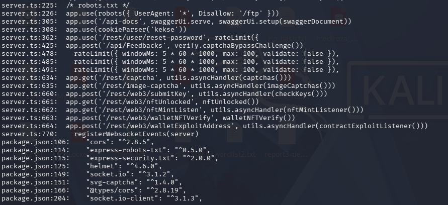

*Figure 43. Additional components identified (2 of 2)*

# 7. Client-Side Analysis

The Angular source was inspected for information an attacker could use during reconnaissance: routes, API endpoints, configuration, technology details, functionality and other security-relevant data.

## 7.1 Additional Routes

- **Authentication:** login, register, forgot-password, change-password, 2fa/enter
- **User functionality:** basket, order-history, saved-payment-methods, wallet, data-export
- **Administrative:** admin, administration, accounting, score-board
- **Challenge-related:** coding-challenge/:challengeKey, hacking-instructor, web3-sandbox
- **Web3/NFT:** juicy-nft, wallet-web3
- **Other:** chatbot, conversation/:id, track-result, recycle, photo-wall

The client-side application therefore exposes a broader functional surface than the homepage suggests.

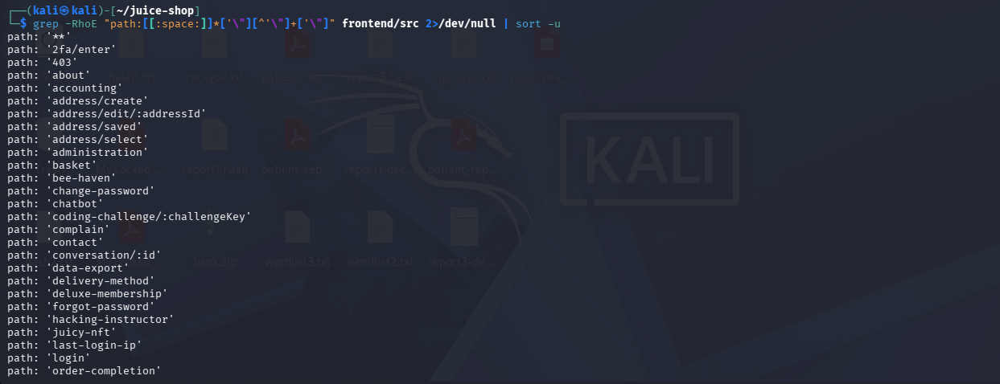

*Figure 44. Client-side route definitions (1 of 2)*

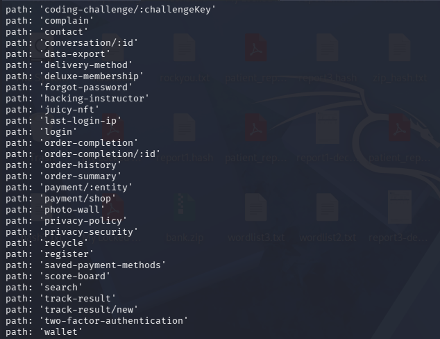

*Figure 45. Client-side route definitions (2 of 2)*

## 7.2 API Endpoints

- **User management:** /api/Users, /rest/user/login, /rest/user/whoami, /rest/user/change-password, /rest/user/reset-password
- **Products:** /api/Products, /rest/products/search, review endpoints
- **Basket and orders:** /api/BasketItems, /rest/basket, /rest/order-history
- **Payment:** /api/Cards
- **Addresses and delivery:** /api/Addresss, /api/Deliverys
- **2FA:** /rest/2fa/setup, /rest/2fa/status, /rest/2fa/verify, /rest/2fa/disable
- **Administrative:** /rest/admin/application-configuration, /rest/admin/application-version
- **Other:** CAPTCHA, wallet, Web3, challenges, continue-code, chat, complaints, feedback, recycle, languages, country mapping, tracking

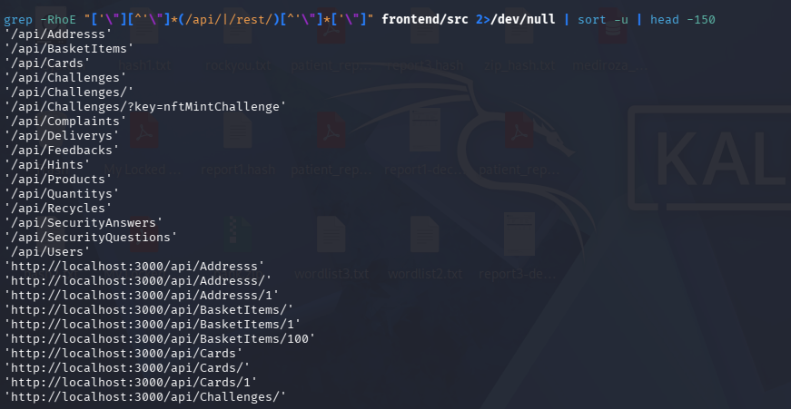

*Figure 46. API endpoints referenced by client-side services (1 of 2)*

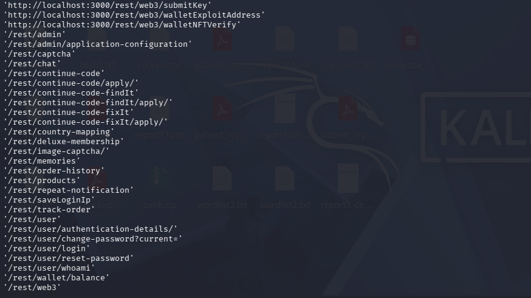

*Figure 47. API endpoints referenced by client-side services (2 of 2)*

## 7.3 Configuration Information

- The frontend references the administrative endpoint `/rest/admin/application-configuration`; the returned configuration is stored and used by frontend functionality (for example, the Hacking Instructor component reads hint-playback settings).
- Client resources reference application configuration and AI-related functionality, but the examined source did **not** reveal an actual secret API key or credential.
- Configuration endpoints and client-side configuration handling should therefore be considered in further assessment.

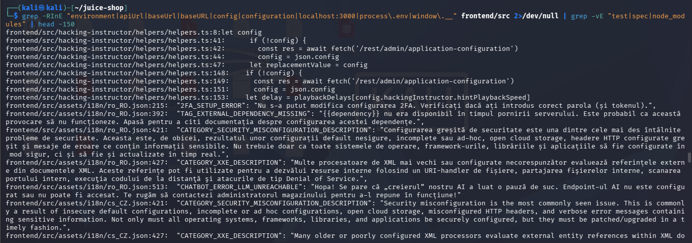

*Figure 48. Client-side configuration references (1 of 2)*

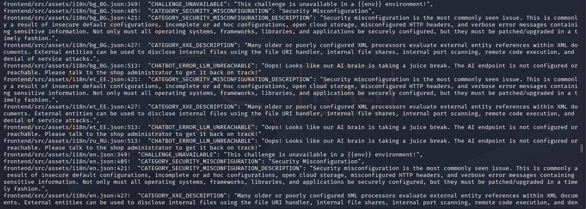

*Figure 49. Client-side configuration references (2 of 2)*

## 7.4 Technology Information

- **Angular** (primary framework) and **Angular Router** (client-side routing)
- **Angular Material / CDK** (UI components), **RxJS** (reactive programming)
- **Socket.IO** (real-time communication), **JWT Decode** (client-side token decoding)
- **Bootstrap / Material components** (UI)

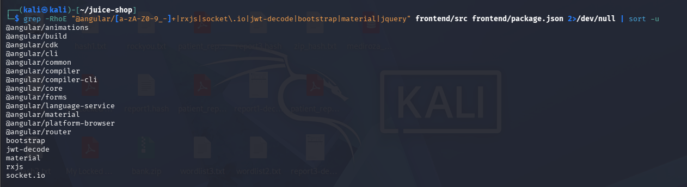

*Figure 50. Frontend technology stack evidence*

## 7.5 Interesting Application Functionality

- Authentication and 2FA
- Administrative functionality
- AI chatbot
- Payment and checkout, saved payment methods
- Wallet and Web3/NFT
- CAPTCHA mechanisms
- Data export
- Complaints and feedback
- Deluxe membership
- Security challenge and coding-challenge functionality
- Order and delivery tracking

Each of these is functionality that may require separate security testing.

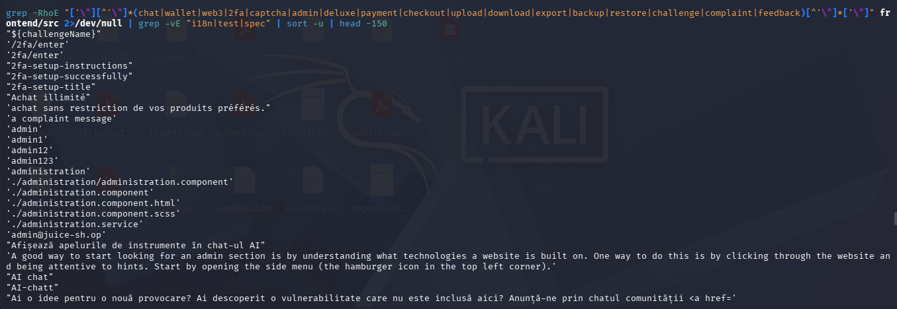

*Figure 51. Security-sensitive functionality in the client code (1 of 2)*

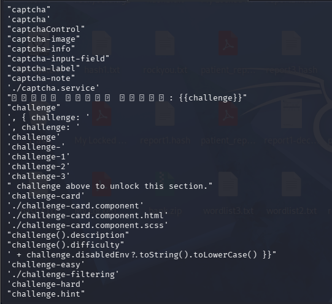

*Figure 52. Security-sensitive functionality in the client code (2 of 2)*

## 7.6 Other Information Relevant to Security Testing

- **JWT and token handling:** the client uses `jwtDecode` and reads a token from `localStorage`. The decoded token contains role information, which the frontend uses to handle administrative functionality.
- **Administrative configuration:** the frontend communicates with `/rest/admin/application-configuration`.
- **Security-related functionality:** client resources contain challenge material related to authentication, password handling, administrative access, exposed credentials, SQL injection and XSS.
- **Web3/NFT:** the client contains Web3/NFT functionality and contract information, adding another technology area to the testing scope.
- **Important observation:** strings such as `admin` and `admin123`, and other credential-like values, appear in the client-side challenge/source material. They were treated as training/challenge content, **not** as confirmed live credentials, and no credential validation was performed.

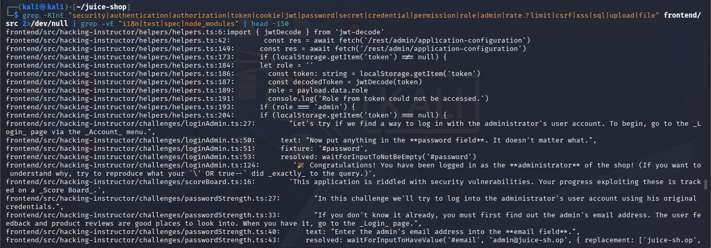

*Figure 53. Token handling, configuration and challenge material in client code (1 of 3)*

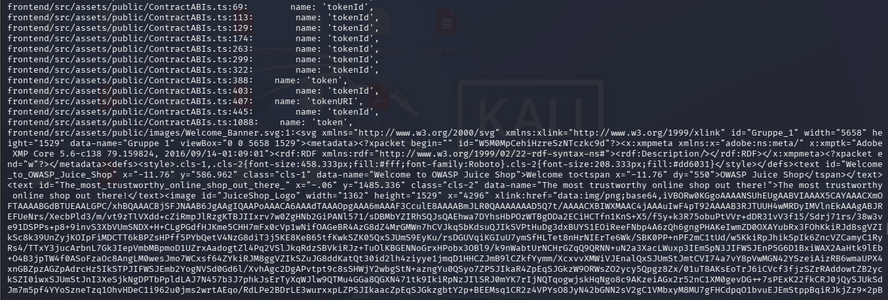

*Figure 54. Token handling, configuration and challenge material in client code (2 of 3)*

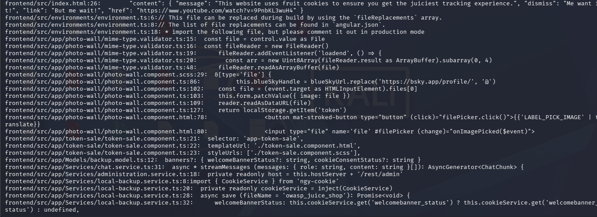

*Figure 55. Token handling, configuration and challenge material in client code (3 of 3)*

## 7.7 Overall Finding

The frontend exposes substantial information about the application’s architecture: additional routes, API endpoints, configuration references, technology components, token handling, administrative functionality, payment features and security-related logic. This information feeds directly into the inventory and prioritization that follow.

# 8. Attack-Surface Map

The diagram shows how the major components discovered during reconnaissance relate to each other, from the external entry points through the Angular client, the Express server, the API layer and access-control middleware down to application functionality and the database.

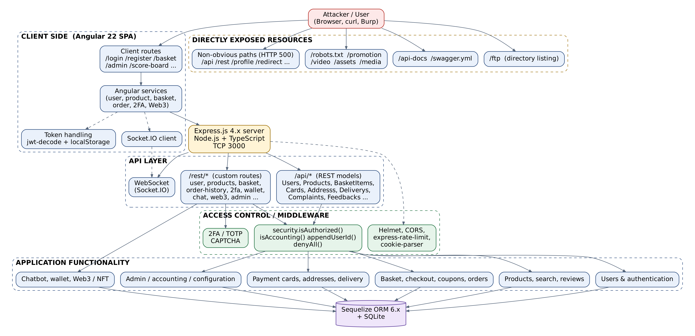

*Figure 56. Attack-surface map of OWASP Juice Shop*

## 8.1 Major Attack-Surface Areas

| Component             | Discovered Attack Surface                                 | Security Relevance                                     |
|-----------------------|-----------------------------------------------------------|--------------------------------------------------------|
| **Frontend**          | Angular routes, services, client-side resources           | Reveals application structure and functionality        |
| **Authentication**    | Login, registration, password reset, change password, 2FA | Handles user identity and authentication               |
| **User APIs**         | Users, profile-related functionality, authentication APIs | Processes user information and account operations      |
| **Product APIs**      | Products, search, reviews                                 | Handles product data and user-generated content        |
| **Basket & Orders**   | Basket, checkout, coupons, order history                  | Handles transactions and order operations              |
| **Payment**           | Cards and saved payment methods                           | Handles payment-related information                    |
| **Administration**    | Admin, administration, accounting, configuration          | Contains privileged application functionality          |
| **Web3/NFT**          | Wallet, NFT and Web3 functionality                        | Introduces additional technology and API surface       |
| **Chat/AI**           | Chatbot and conversation functionality                    | Provides additional user-input interaction points      |
| **Security Services** | CAPTCHA, 2FA, authentication mechanisms                   | Supports access-control and security functionality     |
| **Database**          | SQLite with Sequelize ORM                                 | Stores application data                                |
| **API Documentation** | Swagger / API documentation                               | Provides information about available API functionality |

## 8.2 Map Interpretation

The Angular frontend is the main user entry point and exposes routes and client-side services. These services communicate with the Express.js backend through `/api` and `/rest`. The backend contains separate functional areas for users, products, baskets, orders, payments, administration, authentication, Web3, chat and more, with token/JWT handling and 2FA for authentication. Supporting components include SQLite, Sequelize, Swagger documentation, CAPTCHA and security middleware.

> The map represents the discovered attack surface. It does not indicate that any component is vulnerable; vulnerabilities require separate security testing.

# 9. Attack-Surface Inventory

The table lists 50 discovered assets and endpoints with their type, access level, HTTP method, technology, security relevance and testing priority (**38 High**, **9 Medium**, **3 Low**).

| Asset / Endpoint                          | Type              | Access      | Method              | Technology        | Security Relevance                            | Priority |
|-------------------------------------------|-------------------|-------------|---------------------|-------------------|-----------------------------------------------|----------|
| `/login`                                  | Web               | Public      | GET                 | Angular           | Authentication, session and input handling    | High     |
| `/register`                               | Web               | Public      | GET                 | Angular           | Account creation and validation               | High     |
| `/forgot-password`                        | Web               | Public      | GET                 | Angular           | Password-reset workflow                       | High     |
| `/change-password`                        | Web               | Auth        | GET                 | Angular           | Password-change functionality                 | High     |
| `/2fa/enter`                              | Web               | Auth        | GET                 | Angular           | 2FA authentication flow                       | High     |
| `/rest/user/login`                        | API               | Public      | POST                | Express REST API  | Login and authentication processing           | High     |
| `/rest/user/reset-password`               | API               | Public      | POST                | Express REST API  | Password-reset logic                          | High     |
| `/rest/user/change-password`              | API               | Auth        | GET                 | Express REST API  | Password modification and authorization       | High     |
| `/rest/user/whoami`                       | API               | Auth        | GET                 | Express REST API  | Session/user identification                   | High     |
| `/api/Users`                              | API               | Auth        | GET/POST            | Express REST API  | User data and authorization                   | High     |
| `/rest/user/data-export`                  | API               | Auth        | POST                | Express REST API  | Access to user information/data               | High     |
| `/admin`                                  | Web               | Auth/Role   | GET                 | Angular           | Administrative attack surface                 | High     |
| `/administration`                         | Web               | Auth/Role   | GET                 | Angular           | Admin functionality and authorization         | High     |
| `/dashboard`                              | Web               | Auth/Role   | GET                 | Angular           | Privileged application functionality          | High     |
| `/rest/admin/application-configuration`   | API               | Admin/Role  | GET                 | Express REST API  | Configuration and privilege boundaries        | High     |
| `/rest/admin/application-version`         | API               | Admin/Role  | GET                 | Express REST API  | Application information disclosure            | Medium   |
| `/api/Products`                           | API               | Auth/Role   | POST/DELETE         | Express REST API  | Product authorization and input handling      | High     |
| `/rest/products/search`                   | API               | Public      | GET                 | Express REST API  | Search input and server-side processing       | High     |
| `/rest/products/:id/reviews`              | API               | Public/Auth | GET/PUT             | Express REST API  | Object access and user-generated content      | High     |
| `/api/BasketItems`                        | API               | Auth        | POST/PUT            | Express REST API  | Basket manipulation and authorization         | High     |
| `/rest/basket/:id`                        | API               | Auth        | GET                 | Express REST API  | Basket/object access control                  | High     |
| `/rest/basket/:id/checkout`               | API               | Auth        | POST                | Express REST API  | Checkout and transaction workflow             | High     |
| `/rest/basket/:id/coupon/:coupon`         | API               | Auth        | PUT                 | Express REST API  | Coupon/business-logic handling                | High     |
| `/rest/order-history`                     | API               | Auth        | GET                 | Express REST API  | Order and user data access                    | High     |
| `/rest/order-history/orders`              | API               | Accounting  | GET                 | Express REST API  | Privileged order information                  | High     |
| `/rest/order-history/:id/delivery-status` | API               | Accounting  | PUT                 | Express REST API  | Privileged order modification                 | High     |
| `/api/Cards`                              | API               | User/Auth   | GET/POST/PUT/DELETE | Express REST API  | Payment-card functionality and authorization  | High     |
| `/api/Addresss`                           | API               | User/Auth   | GET/POST/PUT/DELETE | Express REST API  | Personal data and object-level access         | High     |
| `/api/Deliverys`                          | API               | Auth/Role   | GET                 | Express REST API  | Delivery information and authorization        | Medium   |
| `/rest/2fa/setup`                         | API               | Auth        | GET/POST            | Express + TOTP    | 2FA setup and account security                | High     |
| `/rest/2fa/verify`                        | API               | Auth        | POST                | Express + TOTP    | 2FA verification logic                        | High     |
| `/rest/2fa/status`                        | API               | Auth        | GET                 | Express + TOTP    | 2FA state information                         | Medium   |
| `/rest/captcha`                           | API               | Public      | GET                 | Express + CAPTCHA | Anti-automation mechanism                     | Medium   |
| `/rest/image-captcha`                     | API               | Public      | GET                 | Express + CAPTCHA | CAPTCHA implementation                        | Medium   |
| `/rest/chat`                              | API               | Public/Auth | POST                | Express + Chat    | User-controlled input and chat processing     | High     |
| `/rest/wallet/balance`                    | API               | Auth        | GET/PUT             | Express + Wallet  | Financial/business logic                      | High     |
| `/rest/web3/*`                            | API               | Public/Auth | GET/POST            | Express + Web3    | Web3/NFT functionality                        | High     |
| `/wallet-web3`                            | Web               | Public/Auth | GET                 | Angular + Web3    | Web3 wallet functionality                     | High     |
| `/web3-sandbox`                           | Web               | Public/Auth | GET                 | Angular + Web3    | Web3 testing functionality                    | High     |
| `/ftp`                                    | Web Resource      | Public      | GET                 | Express           | Public file/resource exposure                 | High     |
| `/swagger.yml`                            | API Documentation | Public      | GET                 | Swagger/OpenAPI   | Reveals API structure and attack surface      | High     |
| `/api-docs`                               | API Documentation | Public      | GET                 | Swagger UI        | API enumeration and documentation             | High     |
| `/chatbot`                                | Web               | Public/Auth | GET                 | Angular           | AI/chat functionality and input handling      | Medium   |
| `/data-export`                            | Web               | Auth        | GET                 | Angular           | Sensitive user-data functionality             | High     |
| `/coding-challenge/:challengeKey`         | Web               | Public/Auth | GET                 | Angular           | Challenge functionality and application logic | Medium   |
| `/track-result`                           | Web               | Public/Auth | GET                 | Angular           | Order tracking and input handling             | Medium   |
| `/recycle`                                | Web/API           | Public/Auth | GET/POST            | Angular + Express | User input and backend processing             | Medium   |
| `/robots.txt`                             | Web Resource      | Public      | GET                 | Express           | Reconnaissance information                    | Low      |
| `/video`                                  | Web Resource      | Public      | GET                 | Express           | Public media resource                         | Low      |
| `/promotion`                              | Web               | Public      | GET                 | Angular + Express | General application functionality             | Low      |

# 10. Prioritized Testing Plan

Areas were ranked by the potential security impact of the component (sensitive data, privileged functions, financial logic, authentication) and by how directly an unauthenticated or low-privileged user can reach it.

## 10.1 High-Priority Areas

| Area                               | Key endpoints                                                                                  | Why investigate first                                                                                                                             |
|------------------------------------|------------------------------------------------------------------------------------------------|---------------------------------------------------------------------------------------------------------------------------------------------------|
| Authentication & password recovery | /login, /register, /forgot-password, /rest/user/login, /rest/user/reset-password               | Controls identity for the whole application and is reachable without authentication. Weaknesses here affect every other component.                |
| User / account APIs                | /api/Users, /rest/user/whoami, /rest/user/change-password, /rest/user/data-export              | Process and return personal data; correct per-user authorization is critical.                                                                     |
| Administration                     | /admin, /administration, /dashboard, /rest/admin/application-configuration                     | Privileged functionality. Routes return HTTP 200 and the client uses role data from a decoded token, so privilege boundaries need to be verified. |
| Product APIs                       | /api/Products, /rest/products/search                                                           | Search takes user input processed server-side; write methods (POST/DELETE) require strict authorization.                                          |
| Basket & checkout                  | /rest/basket/:id, /rest/basket/:id/checkout, /rest/basket/:id/coupon/:coupon, /api/BasketItems | ID-based object access and coupon / checkout business logic are classic access-control and logic-flaw areas.                                      |
| Orders                             | /rest/order-history, /rest/order-history/orders, /rest/order-history/:id/delivery-status       | Expose other users’ order data; accounting-level operations must not be reachable by normal users.                                                |
| Payment cards & addresses          | /api/Cards, /api/Addresss                                                                      | Hold payment and personal data and support full GET/POST/PUT/DELETE, so object-level access control is key.                                       |
| 2FA                                | /rest/2fa/setup, /rest/2fa/verify, /2fa/enter                                                  | Second authentication factor; flaws could undermine account protection.                                                                           |
| /ftp exposure                      | /ftp                                                                                           | Public directory listing with backup, key-store and configuration-style file names.                                                               |
| Swagger / API documentation        | /swagger.yml, /api-docs                                                                        | Public, complete map of the API that speeds up any attacker’s enumeration.                                                                        |
| Web3 / wallet                      | /rest/web3/\*, /rest/wallet/balance, /wallet-web3, /web3-sandbox                               | Financial and blockchain-related logic, a less common technology area with its own risks.                                                         |
| Chat / input processing            | /rest/chat                                                                                     | Accepts free-form user input that is processed by the server.                                                                                     |

## 10.2 Medium-Priority Areas

- Search and reviews (user-generated content)
- CAPTCHA and image CAPTCHA (anti-automation controls)
- Chatbot
- Delivery (/api/Deliverys)
- Tracking (/rest/track-order/:id, /track-result)
- Recycle
- Application configuration / version disclosure (/rest/admin/application-version)
- Security / challenge functionality (/coding-challenge/:challengeKey)

## 10.3 Low-Priority Areas

- `/robots.txt` — reconnaissance value only
- `/video` — public media resource
- `/promotion` — general application content

## 10.4 Suggested Order for the Next Phase

1.  Authentication, password recovery and 2FA
2.  Object-level access control on user, basket, order, card and address APIs
3.  Administrative and configuration endpoints
4.  Input handling in search, reviews and chat
5.  Exposed resources (`/ftp`, Swagger) and the Web3 / wallet area

# 11. Conclusion

Starting from an application with no predefined endpoint list, the assessment answered the key reconnaissance questions:

| Question                        | Answer                                                                                                                                    |
|---------------------------------|-------------------------------------------------------------------------------------------------------------------------------------------|
| What is exposed?                | Public pages and resources (/ftp, Swagger, robots.txt, promotion, video), about 40 client routes, and a large /api and /rest surface.     |
| How is it structured?           | Angular SPA → Express.js REST API (/api, /rest) → Sequelize ORM → SQLite, with middleware-based authorization.                            |
| Which technologies are present? | Angular 22, Node.js, Express 4.22, TypeScript, SQLite, Sequelize 6, JWT, 2FA/TOTP, Socket.IO, Swagger, Helmet, CORS, rate limiting, Web3. |
| Where are the entry points?     | Login / registration / reset flows, user and basket APIs, admin routes, chat, Web3, and the exposed /ftp and Swagger resources.           |
| What should be tested first?    | Authentication, access control on user-owned objects, administration, checkout and payment logic (Section 10).                            |

The assessment stayed within the reconnaissance scope; the next phase can use this inventory and priority list to drive a structured penetration test.

# Appendix A: Original Diagram

Original attack-surface diagram prepared during the exercise:

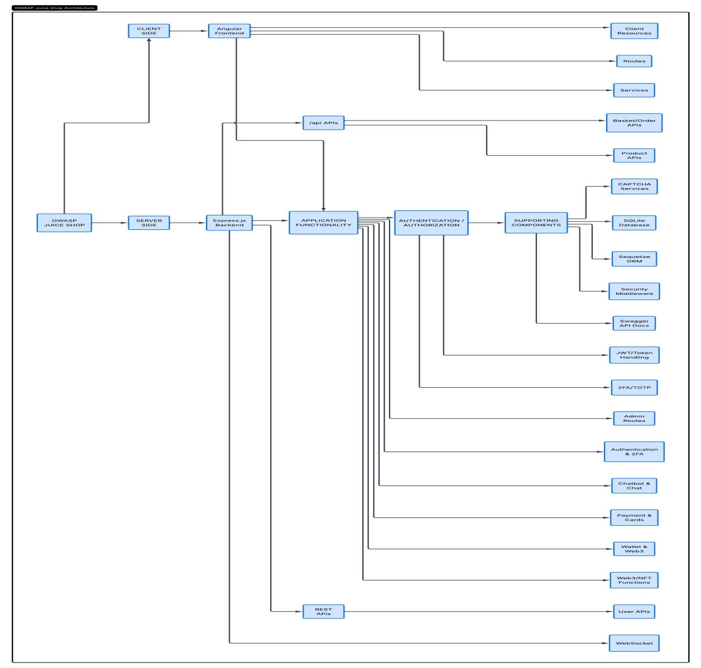

*Figure 57. Original attack-surface diagram (draw.io style)*
